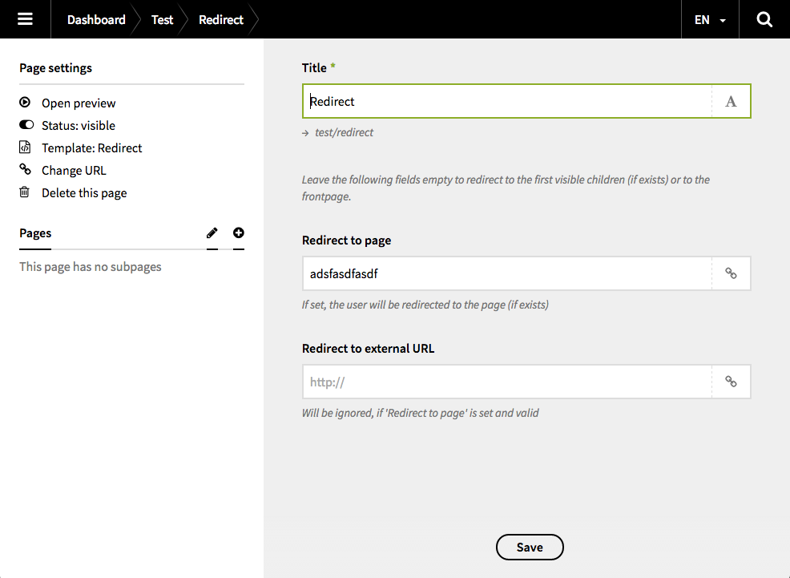

# Kirby Redirect

 

With this plugin for [Kirby 2](http://getkirby.com) editors can create pages which redirect to its first visible child, any other page or an external url.

## Requirements

Please notice that you need at least **Kirby 2.3** to use this plugin.

## Preview

## Installation

Just put the `redirect` folder in the `site/plugins` folder of your Kirby installation. If this folder doesn't exist, create it.

There's a `package.json` file included if you want to use the [Kirby CLI](https://github.com/getkirby/cli).

## Customization

If you like, you can copy and paste the blueprint from `site/plugin/redirect/blueprints/redirect.yml` to `site/blueprints/redirect.yml` to adjust the text or add some translations. 

**But please make sure not to change the keys of the fields.**

## Changelog

### 1.0
+ add page model and `isExternal()` page method
+ some more documentation (and changelog)

### 0.2

+ check if page exists before redirecting
+ add possibility to redirect to external url

### 0.1

+ initial version

## Authors

+ [Flo Kosiol](https://github.com/flokosiol)
+ [Benedict Zinke](https://github.com/bezin)

